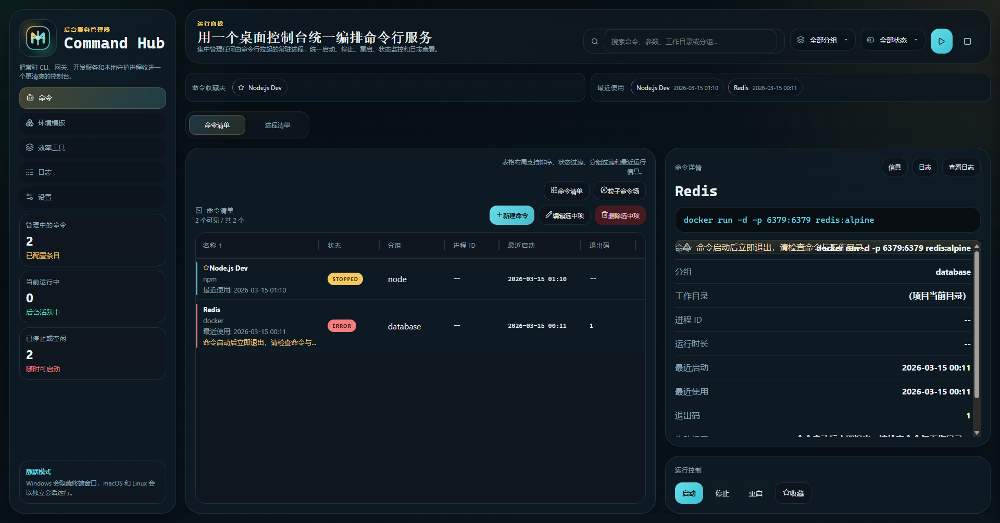
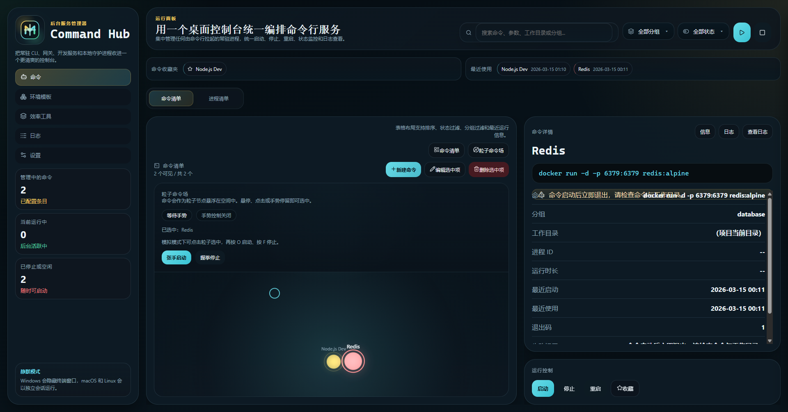
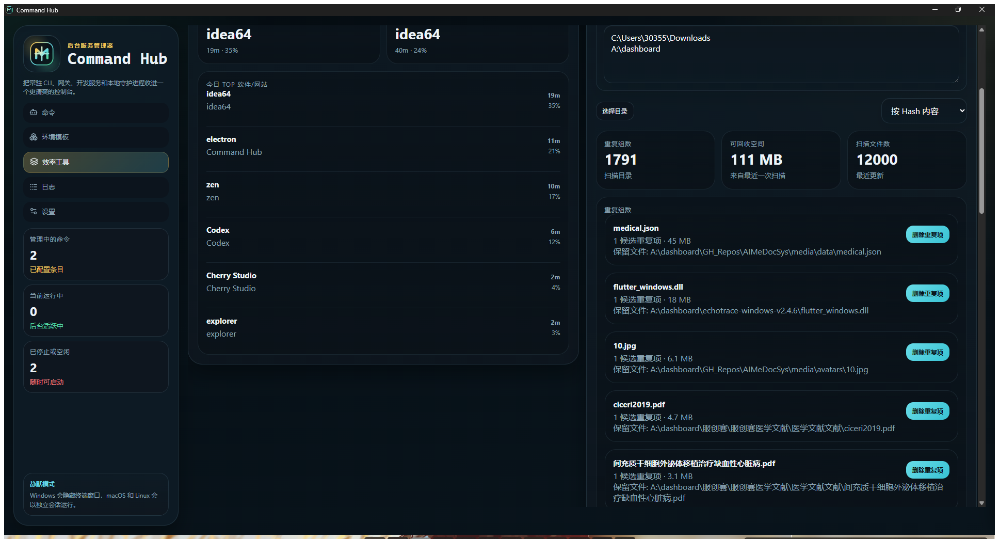
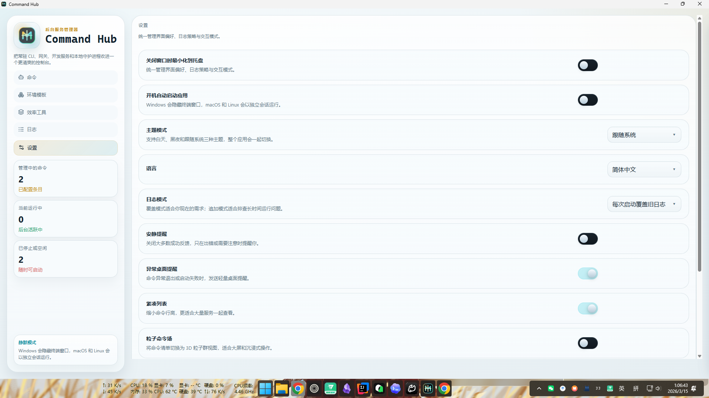
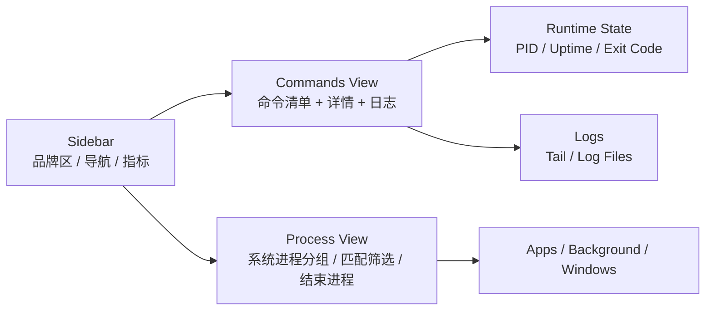
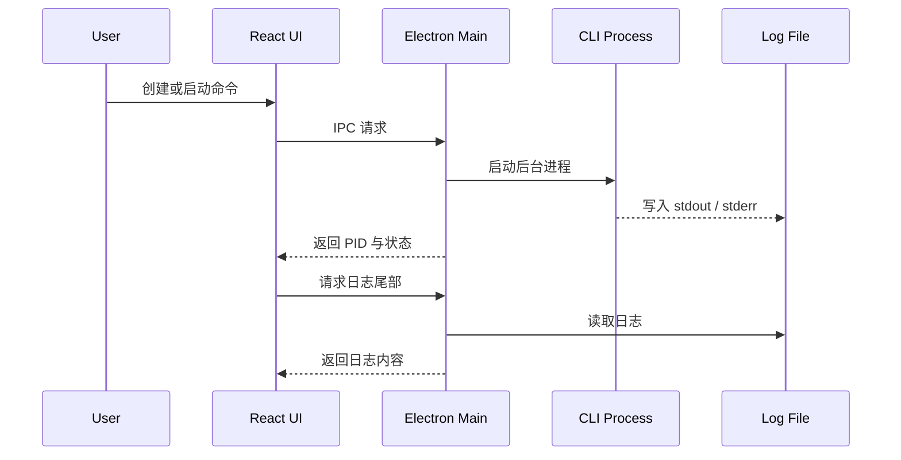

<div align="center">

# Command Hub


**Command Hub 是一个面向桌面的后台命令管理器，用来把原本散落在多个终端标签页里的常驻命令收拢到一个统一界面里管理。**


[](https://github.com/alleyf/CommandHub)
[](https://github.com/alleyf/CommandHub)
[](https://github.com/alleyf/CommandHub/issues)
[](https://github.com/alleyf/CommandHub/pulls)


</div>

它适合这类场景：

- `openclaw gateway start`
- `cli-proxy-api.exe`
- `npm run dev`
- `python server.py`
- 任何需要长期驻留、查看日志、随时重启或结束的本地 CLI 进程

## 演示画廊（图文表）

> 说明：以下图片/视频路径为项目内约定位置。你可以直接替换同名文件，README 会自动显示最新效果。

### 截图

| 场景 | 预览 |
| --- | --- |
| 命令面板总览 |  |
| 粒子命令场 + 手势预览 |  |
| 效率工具中心 |  |
| 系统配置管理 |  |

### 录屏

| 演示内容 | 文件 |
| --- | --- |
<!-- | 命令创建、启动、停止、日志查看 | [command-flow.mp4](docs/media/videos/command-flow.mp4) | -->
<!-- | 手势控制模式（含摄像头预览） | [gesture-mode.mp4](docs/media/videos/gesture-mode.mp4) | -->
| 效率工具扫描流程 | [productivity-scans.mp4](docs/media/videos/productivity-scans.mp4) |


## 产品概览

| 模块 | 作用 | 你能看到什么 |
| --- | --- | --- |
| 命令清单 | 管理自己配置的后台命令 | 名称、状态、PID、最近启动时间、退出码 |
| 进程清单 | 浏览系统当前运行进程 | 分类分组、同程序合并、可展开实例、匹配高亮 |
| 日志面板 | 快速查看命令输出 | 实时尾部日志、自动滚动、日志文件入口 |
| 设置页 | 管理应用级偏好 | 托盘行为、语言、主题、日志模式 |

## 界面结构




## 主要功能

### 1. 后台命令统一管理

| 功能 | 说明 |
| --- | --- |
| 新建命令 | 保存名称、命令、参数、工作目录、环境变量 |
| 启动 / 停止 / 重启 | 统一在桌面界面里控制，不需要反复切终端 |
| 静默启动 | Windows 下尽量隐藏命令启动时弹出的终端窗口 |
| 自动重启 | 可选异常退出后自动拉起 |

### 2. 系统进程巡视

| 功能 | 说明 |
| --- | --- |
| 任务管理器式分类 | 按“应用 / 后台进程 / Windows 进程”分区显示 |
| 同程序合并 | 相同程序自动归成一组，可点击展开 |
| 匹配命令高亮 | 与当前已管理命令相关的进程会突出显示 |
| 一键筛选匹配进程 | 只看和命令清单相关的进程 |
| 结束进程 | 支持直接对单个实例执行结束操作 |

### 3. 日志与状态追踪

| 信息 | 内容 |
| --- | --- |
| 运行状态 | running / stopped / error |
| PID | 当前运行进程 ID |
| Uptime | 运行时长 |
| Exit Code | 最近退出码 |
| Log Tail | 日志尾部实时查看 |

## 适合的使用场景

| 场景 | 示例 |
| --- | --- |
| AI 网关 / 代理 | `openclaw gateway start`、`cli-proxy-api.exe` |
| 本地开发服务 | `npm run dev`、`vite`、`next dev` |
| Python 服务 | `python app.py`、`uvicorn main:app` |
| 常驻脚本 | 同步器、守护脚本、本地 worker |

## 技术栈

| 层 | 技术 |
| --- | --- |
| 桌面容器 | `Electron` |
| 前端界面 | `React 19` |
| 构建工具 | `Vite 7` |
| 本地图标生成 | `Node.js` 脚本生成 `svg/png/ico` |

## 开发命令

| 命令 | 作用 |
| --- | --- |
| `npm install` | 安装依赖 |
| `npm run start` | 启动 Vite + Electron 开发环境 |
| `npm run build` | 构建前端资源 |
| `npm run brand:generate` | 重新生成品牌图标资源 |

```powershell
npm install
npm run brand:generate
npm run start
```

## 配置项说明

| 字段 | 说明 | 示例 |
| --- | --- | --- |
| `Display Name` | 页面里展示的命令名称 | `cli-proxy-api` |
| `Executable` | 实际执行的命令或程序 | `cli-proxy-api.exe` |
| `Arguments` | 追加参数 | `gateway start` |
| `Working Directory` | 可选工作目录 | `D:\CLIProxyAPI_6.8.51_windows_amd64` |
| `Environment Variables` | 一行一个 `KEY=VALUE` | `PORT=8080` |
| `Auto Restart` | 异常退出时自动重启 | `true / false` |

## 数据存储

应用会把运行数据保存在 Electron 用户目录下的 `command-hub` 文件夹中。

| 文件 | 说明 |
| --- | --- |
| `commands.json` | 保存命令配置 |
| `runtime.json` | 保存当前运行时状态 |
| `settings.json` | 保存应用设置 |
| `logs/*.log` | 各命令日志文件 |

Windows 常见位置示例：

```text
C:\Users\<YourUser>\AppData\Roaming\command-hub\command-hub
```

## 运行流程



## 当前亮点

- 进程清单已经支持分类分组、同程序合并、匹配高亮和筛选
- Windows 下命令启动路径已经针对“隐藏终端窗口”做过加强处理

## 后续可继续完善

- 增加真正的虚拟滚动，进一步优化超大量进程列表性能
- 接入正式打包链路，输出安装包
- 增加更多命令模板与导入导出能力
- 为 Windows 服务类进程提供更细的识别规则

## License

本项目采用 [MIT License](LICENSE) 开源协议。

